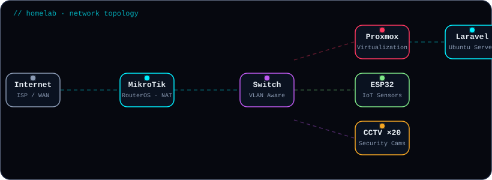
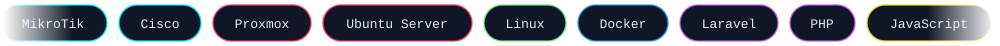
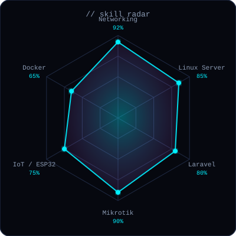

<div align="center">

<!-- ═══════════════════════ ANIMATED HEADER ═══════════════════════ -->


<br/>

<!-- Typing animation -->


<!-- Badges -->
<p>
  
  
  
</p>

<!-- Nav pills -->
<p>
  <a href="#-about-me"></a>
  <a href="#%EF%B8%8F-tech-stack"></a>
  <a href="#-github-analytics"></a>
  <a href="#-featured-projects"></a>
  <a href="#-certifications"></a>
  <a href="#-lets-connect"></a>
</p>

</div>



---

## 🧑‍💻 About Me

<table>
<tr>
<td width="50%" valign="top">

```yaml
name     : "Muhammad Dhiyauddin"
alias    : "Adin"
role     : "Network Engineer & Web Dev"
location : "Jakarta, Indonesia 🇮🇩"
school   : "SMK Wisata Indonesia (TJKT)"

focus:
  - Advanced Networking & Routing
  - Linux Virtualization & Cloud
  - Fullstack Web: Laravel + Tailwind
  - IoT Automation with ESP32

hobbies:
  - Building Homelab Environments
  - CCTV & Security Systems
  - UI/UX & Dashboard Styling
  - Open Source Contributions
```

</td>
<td width="50%" valign="top">

<br/>

🔭 **Working on** → Web apps for **Kos Adin** & **Caffe Adin**

🌱 **Learning** → Cloud Infra, Docker, CI/CD & DevOps

👯 **Open to collab** → Networking, Web & IoT projects

💬 **Ask me about** → MikroTik, Cisco, Proxmox, Ubuntu Server, Laravel, ESP32

📫 **Email** → [dhiyauddintjkt@gmail.com](mailto:dhiyauddintjkt@gmail.com)

⚡ **Fun fact** → I installed 20+ CCTV cameras around my school! 📷

</td>
</tr>
</table>


---

## 🗺️ Homelab · Network Topology

<div align="center">
  
</div>


---

## 🛠️ Tech Stack

<div align="center">
  
</div>

<br/>

<table>
<tr>
<td width="50%">

**🌐 Networking & Infrastructure**


**🔌 IoT & Embedded**


</td>
<td width="50%">

**💻 Fullstack Web Development**


**🎨 Workflow & Tools**


</td>
</tr>
</table>


---

## 📈 Weekly Coding Breakdown & Stats

<div align="center">
  
</div>


---

## 📊 GitHub Analytics

<div align="center">


<br/>


<br/>


<br/>


</div>

### 🐍 Contribution Snake

<div align="center">
  <picture>
    <source media="(prefers-color-scheme: dark)" srcset="https://raw.githubusercontent.com/Dhiyauddin0210/Dhiyauddin0210/output/github-snake-dark.svg"/>
    <source media="(prefers-color-scheme: light)" srcset="https://raw.githubusercontent.com/Dhiyauddin0210/Dhiyauddin0210/output/github-snake.svg"/>
    
  </picture>
</div>


---

## 🎯 Skill Radar

<div align="center">
  
</div>


---

## 🚀 Featured Projects

<div align="center">

<!-- Ganti nama repo dengan yang asli -->
<a href="https://github.com/Dhiyauddin0210/kos-adin">
  
</a>
<a href="https://github.com/Dhiyauddin0210/caffe-adin">
  
</a>

</div>

<details>
<summary><b>📋 Project Details</b></summary>
<br/>

| 🚀 Project | 📝 Description | 🛠 Stack | 🔗 Status |
|---|---|---|:---:|
| 🏠 **Kos Adin** | Boarding-house management web app (tenants, payments, rooms) | Laravel · Tailwind · MySQL | 🟢 Active |
| ☕ **Caffe Adin** | Cafe ordering & management system | Laravel · Tailwind · MySQL | 🟢 Active |

</details>


---

## 🏆 Certifications

<div align="center">

| 🎖️ Certificate | 🏢 Issuer | 📅 Year | Status |
|:---|:---|:---:|:---:|
| **Junior Network Administrator** | BNSP / LSP Teknologi Digital | 2026 | ✅ Certified |
| **Mikrokontroler Competency** | SMK Wisata Indonesia | 2025 | ✅ Verified |
| **UKOM: Virtualisasi Linux & Web Server** | SMK Wisata Indonesia | 2025 | ✅ Verified |

</div>


---

## 💬 Random Dev Quote

<div align="center">
  
</div>


---

## 🤝 Let's Connect

<div align="center">

<a href="mailto:dhiyauddintjkt@gmail.com">
  
</a>
<a href="https://github.com/Dhiyauddin0210">
  
</a>
<!-- Tambahkan LinkedIn / Instagram jika ada:
<a href="https://linkedin.com/in/USERNAME">
  
</a>
<a href="https://instagram.com/USERNAME">
  
</a>
-->

<br/><br/>


</div>
